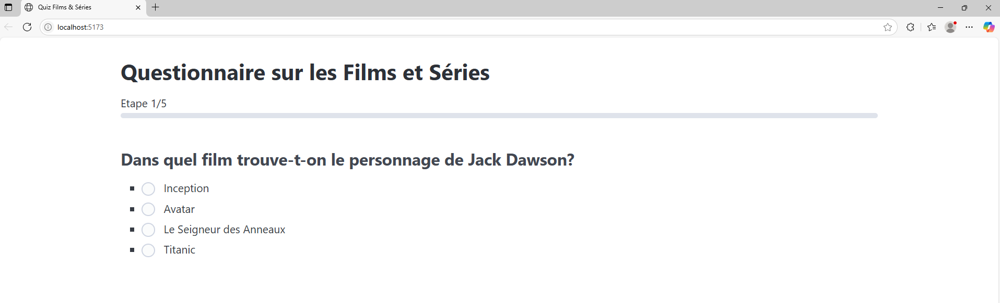
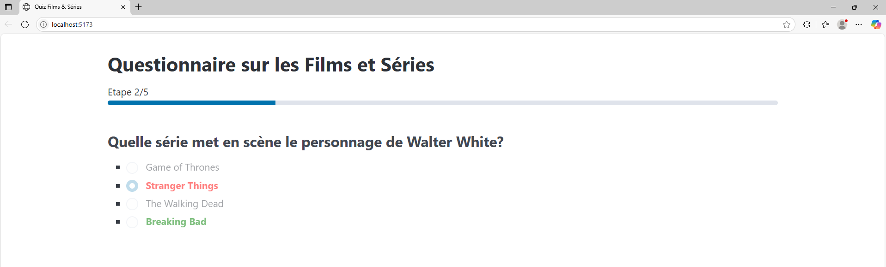
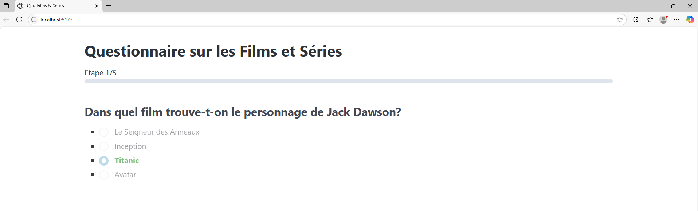
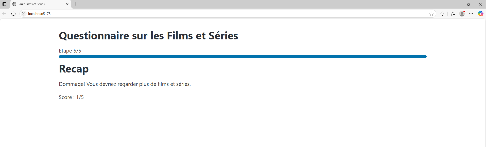
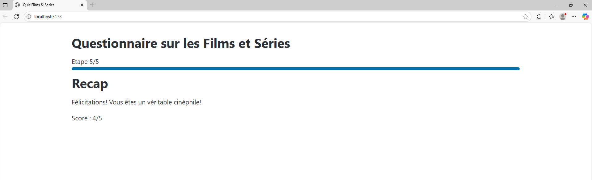

# 🎬 Quiz Films & Séries – Vue 3 + Vite

Un projet interactif de quiz sur les films et séries, développé avec **Vue 3**, **Vite**, et **PicoCSS**.
Le quiz est chargé dynamiquement depuis un fichier JSON, les questions sont affichées une par une, 
et le résultat est présenté à la fin avec un message personnalisé selon le score.

---

## ➤ Table des matières

- [➤ Technologies utilisées](https://github.com/amandinekemp/questionnaire#-technologies-utilis%C3%A9es)
- [➤ Lancer le projet](https://github.com/amandinekemp/questionnaire#-lancer-le-projet)
- [➤ Contenu du fichier quiz.json](https://github.com/amandinekemp/questionnaire#-contenu-du-fichier-quizjson)
- [➤ Fonctionnalités](https://github.com/amandinekemp/questionnaire#-fonctionnalit%C3%A9s)
- [➤ Composants clés](https://github.com/amandinekemp/questionnaire#-composants-cl%C3%A9s)
- [➤ Astuces de développement](https://github.com/amandinekemp/questionnaire#%EF%B8%8F-astuces-de-d%C3%A9veloppement)
- [➤ License](https://github.com/amandinekemp/questionnaire#-licence)
- [➤ Aperçu](https://github.com/amandinekemp/questionnaire#%EF%B8%8F-aper%C3%A7u)
- [➤ Contact](https://github.com/amandinekemp/questionnaire#-contact)

## 🧱 Technologies utilisées

* [Vue 3 (Composition API)](https://vuejs.org/)
* [Vite](https://vitejs.dev/)
* [PicoCSS](https://picocss.com/) – Design minimaliste et responsive
* JavaScript natif

---

## 🚀 Lancer le projet

### 1. Cloner le dépôt

```bash
git clone https://github.com/amandinekemp/questionnaire.git
cd quiz-vue
```

### 2. Installer les dépendances

```bash
npm install
```

### 3. Lancer le serveur de développement

```bash
npm run dev
```

Le projet sera accessible à l'adresse : `http://localhost:5173`

---

## 📄 Contenu du fichier `quiz.json`

Le fichier `public/quiz.json` contient la structure du quiz :

```json
{
  "title": "Questionnaire sur les Films et Séries",
  "minimum_score": 4,
  "success_message": "Félicitations! Vous êtes un véritable cinéphile!",
  "failure_message": "Dommage! Vous devriez regarder plus de films et séries.",
  "questions": [
    {
      "question": "Dans quel film trouve-t-on le personnage de Jack Dawson?",
      "choices": ["Titanic", "Le Seigneur des Anneaux", "Inception", "Avatar"],
      "correct_answer": "Titanic"
    },
    ...
  ]
}
```

---

## 🧠 Fonctionnalités

### ✅ Chargement dynamique

* Les données du quiz sont chargées depuis `/quiz.json` via `fetch`.

### ✅ Affichage progressif

* Une question à la fois.
* Réponses mélangées aléatoirement.

### ✅ Feedback visuel

* Réponse correcte : texte vert ✅
* Réponse incorrecte : texte rouge ❌
* Les autres options sont désactivées après réponse.

### ✅ Timer automatique

* Si l’utilisateur ne répond pas dans le délai, la question passe.

### ✅ Résultats

* Résumé de toutes les réponses.
* Message de réussite ou d’échec selon le score.

---

## 📦 Composants clés

| Composant              | Rôle                                                       |
| ---------------------- |------------------------------------------------------------|
| `AppQuestionnaire.vue` | Gère l'état global (étapes, réponses, affichage)           |
| `Quiz.vue`             | Conteneur de l'affichage du quiz                           |
| `Questions.vue`        | Affiche chaque question avec choix aléatoires              |
| `Answer.vue`           | Composant radio stylisé (feedback correct/incorrect)       |
| `Progress.vue`         | Barre de progression                                       |
| `Recap.vue`            | Résumé final avec réponses données et message personnalisé |

---

## 🛠️ Astuces de développement

* Le `v-model` est implémenté manuellement dans `Answer.vue` pour bien propager la réponse à `Questions.vue`.
* `shuffleArray` mélange les choix une seule fois lors du `onMounted`.
* L'utilisation de `:key="question.question"` dans `Questions.vue` garantit la réinitialisation à chaque nouvelle question.
 style est lisible (PicoCSS fait le reste)

---

## 📄 Licence

Projet open-source sous licence [MIT](LICENSE).

---

## 🖼️ Aperçu







---

## ➤ Contact

* Amandine Kemp

    - [Github](https://github.com/amandinekemp)
    - [LinkedIn](https://www.linkedin.com/in/amandinekemp/)
